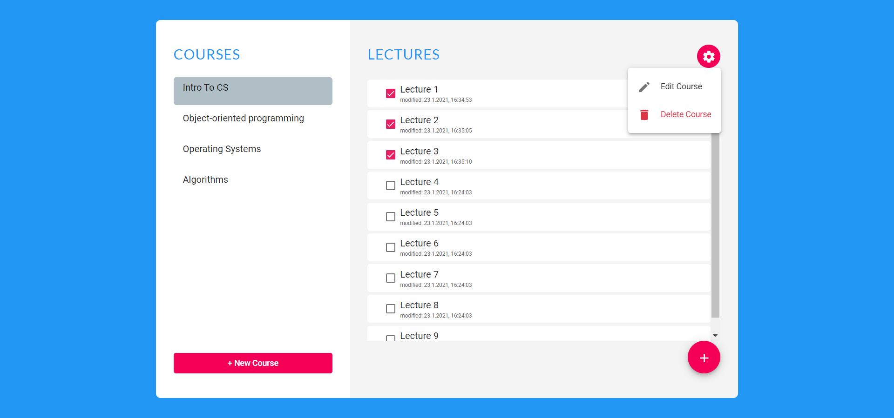
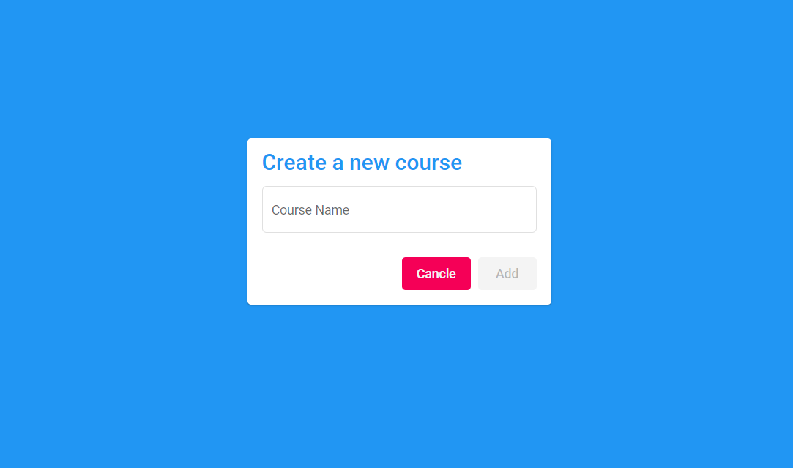
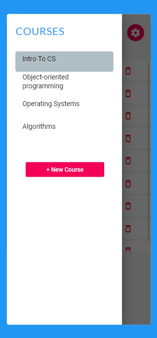
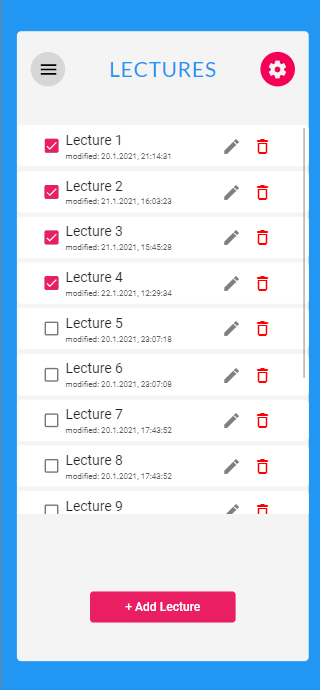

# zoom-tracker

Zoom-Tracker is my first project using Angular. I developed the app in response to a problem I had during the academic studies semester - tracking my viewing content in Zoom.
The app allows the user to track his viewing content in Zoom - add, edit and delete courses and lectures.
In addition, I made it fit for mobile view as well as web.

Demo: [https://zoom-tracker.netlify.app/](https://zoom-tracker.netlify.app/)

## Table Of Contents
- [React Bank](#ReactBank)
  * [Running the project](#running-the-project)
  * [Screenshots](#screenshots)
    + [Main View](#Main View)
    + [New Course](#New Course)
    + [Courses - Mobile Version](#Courses - Mobile Version)
    + [Lectures - Mobile Version](#Lectures - Mobile Version)
  * [Tech Stack](#tech-stack)
  
  ## Running the project

Preferably check the online demo, 

Otherwise:

1. Clone the repo.
2. Run `npm install`.
3. Run `npm run build`
5. Run `npm start`.
6. Navigate to `http://localhost:4200`.

## Screenshots

### Main View
The app's main - view where the user can see his courses and lectures.

### New Course
New Course page, including validation. The New Lecture page is similar.

### Courses - Mobile Version
List of all the user's courses. For the mobile version I used sidenav.

### Lectures - Mobile Version
List of all the user's lectures. 

## Techstack
1. Angular, Angular Material and Bootstrap. 
2. Express (Node.js), Mongoose (MongoDB).

